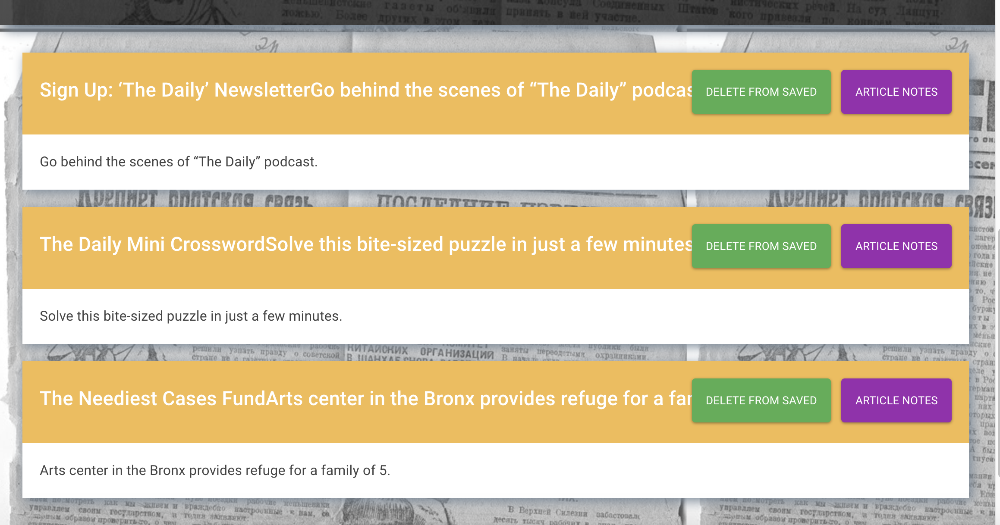

# Mongo-Scraper
Mongo-Scraper is a web app that uses Mongoose and Cheerio to scrape articles from New York Times website and allows user to leave comments on saved articles.
,,
# Technologies Used
- HTML
- Bootstrap
- CSS
- Javascript
- jQuery
- Node.js
- Express.js
- Handlebars.js
- MongoDB
- Mongoose
- cheerio NPM Package
- express NPM Package
- express-handlebars NPM Package
- body-parser NPM Package NPM Package
# Demo
Please follow the link to [Heroku](https://mongo-scraper2019.herokuapp.com/)deployment to play with the project.
